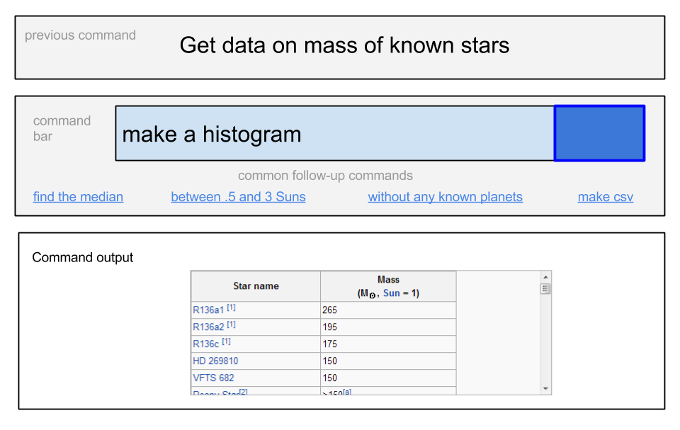
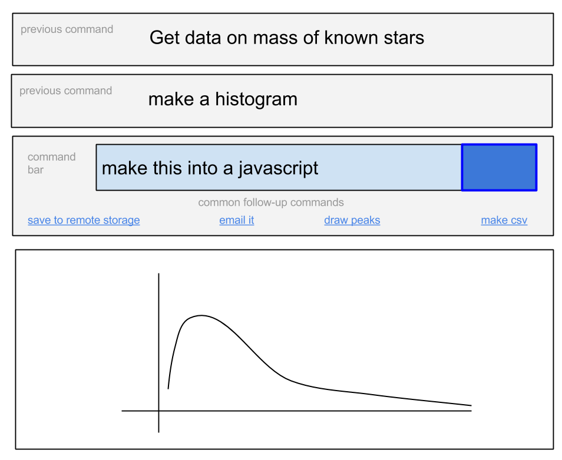
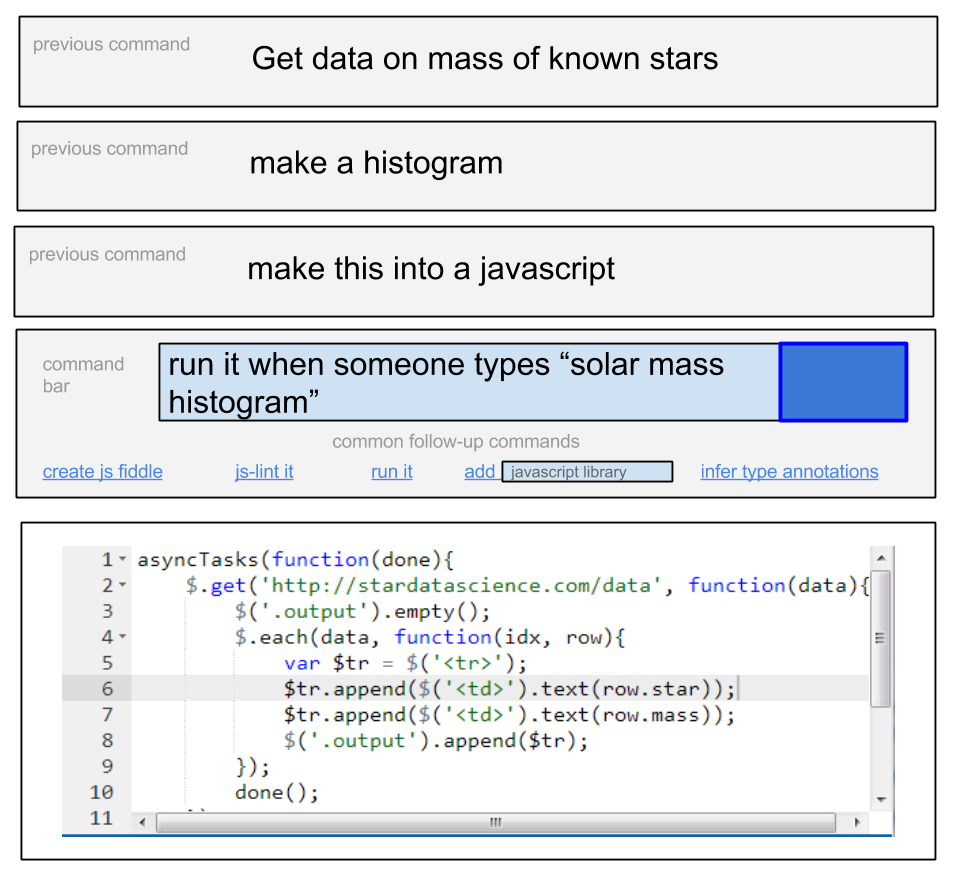

Context Command: A Natural Language Programming System
======================================================
The goal of Context Command is essentially become the Star Trek computer where everything the user says to it is a valid command. The mechanism for building it is as follows, whenever someone tries a command that doesn't work they have the ability to program the system to do what they intended. If enough people do this, unknown commands will become rare.

Increasingly search engines are adding content widgets capable of responding directly to queries (e.g. googling "time in Seattle" or "current weather"). Wolfram Alpha takes this to a new level providing thousands of widgets capable of responding to a wide range of commands. Duck Duck Go has taken the step of enabling its users to create customized Instant Answers by submitting them to a github repository. By crowdsourcing their community Duck Duck Go has been able to build up [an impressive collection of functions](https://duckduckgo.com/goodies).

I propose a command engine focused on these widgets in the vein of Wolfram Alpha. However, what I propose has two features that I believe are missing in similar systems.

1. It is easy as easy as possible for anyone to build their own widgets and modify existing widgets. For example, people are be able to add commands via other commands (e.g. "Add a command triggered by the phrase coffee near me").
2. Commands take context into account. The context is the set of previous commands the user typed during a session. I will demonstrate some of the interesting capabilities this enables in the mockup below.

### Mockup

The user begins by entering the command "Get data on mass of known stars" into an input box, for which they receive a response like this:

By showing the most popular commands for the current context, we are able to generate a de facto UI that allows the user to discover some of the available commands and perform them with the press of a button.

The user follows up by typing "make a histogram." Since the previous commands are used to infer the meaning of the follow-up command the user is able to use very terse commands that would otherwise be ambiguous.

*"Make what I just did into a JavaScript."* I believe this command is one of the most interesting commands that Context Command could have. It allows users to compile natural language into code. Since all the commands are just JavaScript programs, to create a program they just need to be sequentially executed. (However, there are some details that complicate things, such as determining when programs have finished executing and dealing with interactive widgets.)

After that, the user creates a new command from their previous session (in theory the code generation step doesn't need to be explicitly called to do this). **Using this approach, users without any programming expertise are able to program new commands using only natural language by building off of other commands.**

### Implementation details

To add a command users need to define three components, a trigger which is the string the user has to type in order to invoke it, a program that implements the command's behavior, and optionally the command's context, which is a set of commands that the command can only be invoked subsequent to. The trigger can contain variables, such as "city" in "Population of {{city}}," that will be made available to the program. (I believe that variables will cover most use cases and that regexes add unnecessary complexity.) The JavaScript has almost no hard requirements other than it run without error when it is injected into the page. This certainly has security risks, but I propose a way to overcome them via community moderation below. The JavaScript should follow conventions, such as only doing DOM manipulation within the output element. To the greatest extent possible these conventions are defined by the community that moderates the code rather than the Context Command framework.

When a command string is evaluated it may match multiple commands. If no command is found in the context of the previous command, the system will search up the context chain until the top-level context is reached. Take this session for example:

* spectrum of O
* elements with a similar spectrum
* which element is the most common?

The final question could apply to the previous command, but it could also be a command in the top-level context. The user probably meant “Which element with a similar spectrum to O is the most common?” However, had the user not just used a command that “which element is the most common?” could be a follow-up to, we would interpret it as a general question and answer H. If, like in this case, a command outside of the current context is used, the current context should be closed and no longer used to interpret future questions.

There is no automated cleanup of the previous command. This enables subsequent commands to interoperate with previous commands by scraping left over DOM elements and global state without requiring any effort on the part of the initial command's developer. Scraping DOM elements will likely result in brittle and buggy commands. It is left to community moderators to decide when to allow it.

Commands are open source and any registered user can add or edit them. A review process will be required in order to filter out low quality code and malicious code. Whenever a new command is added, users who trigger it will see a prompt like this:
"This code was not fully reviewed and may be hazardous, do you want to proceed?" If a function is modified the previous version will be used until the new one is reviewed, and a passive notification will be shown indicating that there is a newer version that needs review. Users will also be given the option to view the code, and qualified users (i.e. users with enough reputation that they can be assumed to be trustworthy) can review it, accepting for inclusion or rejecting it.

A Stack Overflow style reputation system could be used to encourage creation, editing and moderation activity. This could also be driven by monetary bounties. Context Command affords a clear articulation of the user's wishes. When an user hits a dead end where the command they used lacks the appropriate action, there could be a button they click to post their transcript to an issue tracker along with a reward for making a command that performs an intuitive action.

My hope is that this proposal sparks discussion that I am able to learn new things from, and if there truly is nothing like Context Command in existence, I hope this proposal inspires some coders out there to build a similar system. I would be happy to help with the implementation.
